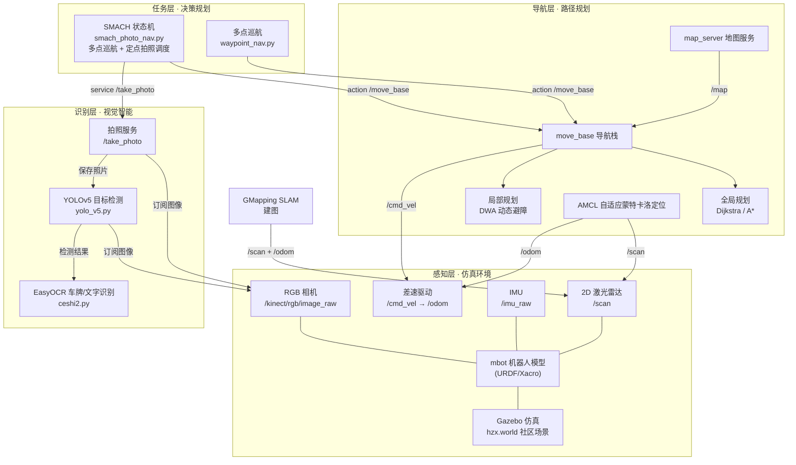
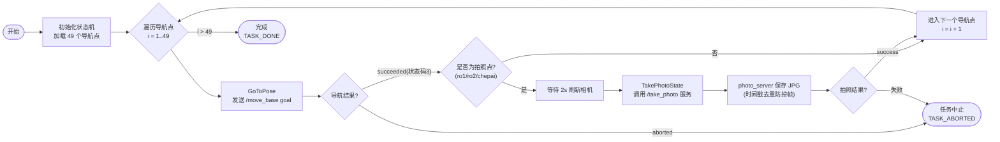
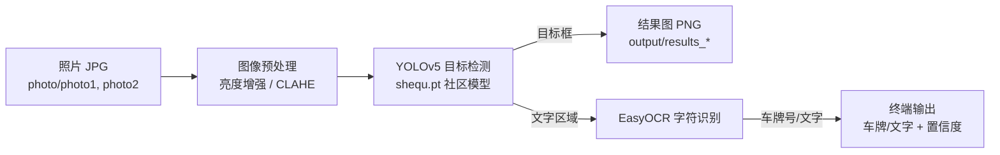

# 智慧社区巡逻机器人系统 — 架构图与流程图

> 基于 ROS 的自主导航 + 视觉识别系统。以下同时给出 Mermaid 图（在 GitHub / Typora / VS Code 中可直接渲染）与 ASCII 文本图（终端可读）。

---

## 一、系统分层架构图



### ASCII 分层架构图

```
┌─────────────────────────────────────────────────────────────┐
│  任务层（决策规划）                                            │
│   SMACH 状态机 (smach_photo_nav.py)  ── 多点巡航 + 定点拍照    │
│        │  action /move_base          │  service /take_photo   │
└────────┼─────────────────────────────┼───────────────────────┘
         ▼                             ▼
┌─────────────────────────────────────────────────────────────┐
│  导航层（路径规划）              ┌─ 识别层（视觉智能）          │
│   move_base 导航栈               │   YOLOv5 目标检测           │
│   ├─ 全局规划 Dijkstra/A*        │   EasyOCR 车牌/文字识别     │
│   ├─ 局部规划 DWA                │   /take_photo 拍照服务      │
│   ├─ AMCL 定位                   └──────────┬─────────────────┘
│   └─ map_server 地图服务                    │ 订阅图像
└────────┬────────────────────────────────────┼─────────────────┘
         │ /cmd_vel  /scan  /odom  /map        │ /kinect/rgb/image_raw
         ▼                                     ▼
┌─────────────────────────────────────────────────────────────┐
│  感知层（仿真环境 Gazebo）                                     │
│   mbot 机器人 (URDF/Xacro)                                    │
│   ├─ 2D 激光雷达 /scan      ├─ RGB 相机 /kinect/rgb/image_raw │
│   ├─ IMU /imu_raw           └─ 差速驱动 /cmd_vel → /odom      │
│   社区世界 hzx.world                                           │
└─────────────────────────────────────────────────────────────┘
```

---

## 二、任务执行流程图（巡航 + 拍照）



### ASCII 流程图

```
                 ┌───────────────┐
                 │  开始          │
                 └───────┬───────┘
                         ▼
                 ┌───────────────┐
                 │ 加载49个导航点 │
                 └───────┬───────┘
                         ▼
              ┌──────────────────────┐
         ┌───▶│ 遍历导航点 i=1..49   │◀───┐
         │    └──────────┬───────────┘    │
         │               ▼                │
         │    ┌──────────────────────┐    │
         │    │ GoToPose 导航        │    │
         │    │ (发 /move_base goal) │    │
         │    └──────────┬───────────┘    │
         │               ▼                │
         │         ┌───────────┐          │
         │         │ 导航成功?  │──否──┐   │
         │         └─────┬─────┘     │   │
         │               │是         ▼   │
         │         ┌─────▼─────┐  ┌──────────┐
         │         │ 是拍照点? │  │ TASK_ABORT│
         │         └──┬─────┬──┘  │  (中止)   │
         │            │是   │否    └──────────┘
         │            ▼     │              ▲
         │   ┌────────────┐ │              │
         │   │ 等待2s     │ │              │
         │   │ 刷新相机   │ │              │
         │   └─────┬──────┘ │              │
         │         ▼        │              │
         │   ┌────────────┐ │              │
         │   │ /take_photo│ │              │
         │   │ 拍照服务    │ │              │
         │   └─────┬──────┘ │              │
         │         ▼        │              │
         │   ┌────────────┐ │              │
         │   │ 保存JPG    │ │              │
         │   │ (时间戳去重)│ │              │
         │   └─────┬──────┘ │              │
         │         ▼        │              │
         │   ┌────────────┐ │              │
         │   │ 拍照成功?  │─否──────────────┘
         │   └─────┬──────┘ │
         │         │是      │
         └─────────┴────────┘  (i=i+1)
                             │
                     i>49时  ▼
                 ┌───────────────┐
                 │ TASK_DONE 完成 │
                 └───────────────┘
```

---

## 三、识别流水线（拍照 → 检测 → 识别）



---

## 四、ROS 节点与话题/服务通信表

| 节点 | 包 | 订阅 | 发布/服务 |
|---|---|---|---|
| `mbot` (Gazebo) | mbot_description | `/cmd_vel` | `/scan` `/odom` `/kinect/rgb/image_raw` `/imu_raw` |
| `slam_gmapping` | gmapping | `/scan` `/odom` | `/map` |
| `amcl` | amcl | `/scan` `/odom` `/map` | `tf`(map→odom) |
| `move_base` | move_base | `/scan` `/odom` `/map` `/tf` | `/cmd_vel` + action |
| `photo_service` | photo_service | `/kinect/rgb/image_raw` | 服务 `/take_photo` |
| `smach_photo_nav` | photo_service | — | action `/move_base` + 调 `/take_photo` |
| `yolov5_ros` | yolov5_ros | `/kinect/rgb/image_raw` | `/yolov5/BoundingBoxes` `/yolov5/detection_image` |
